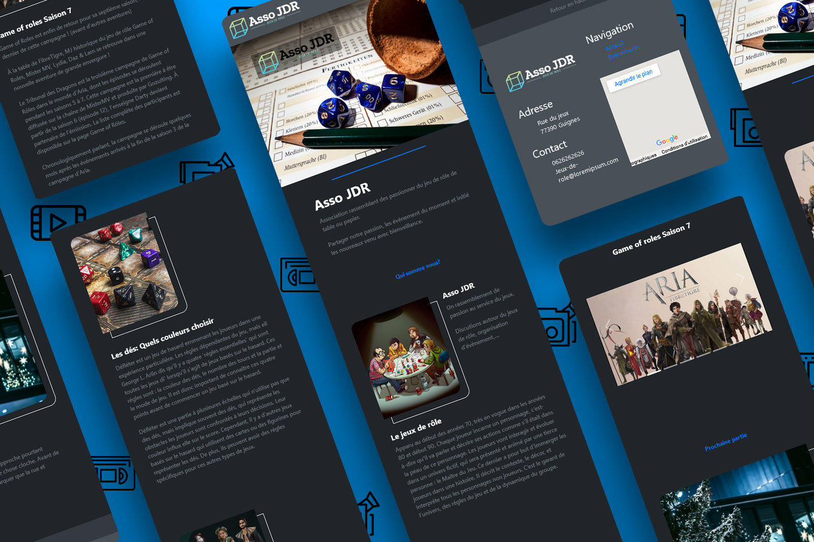

# Studi-Devoir-1 Évaluation d'entraînement

## Créer un site web avec HTML, CSS et le Framework Bootstrap

# Asso JDR

Le site web présente une association fictive "Asso-JDR". Une association de jeux de rôle.  
Le but avec ce site web pour l'association est de se présenter et de rendre accessible à tous les différents évènements liés aux jeux de rôle.  
 

Il contient donc une page principale contenant :
 - un en-tête
 - une partie présentation de l'association et du jeu de rôle
 - un carrousel qui présente les éléments à venir
 - une partie présentant la prochaine partie organiser
 - un pied de pages
 

Puis une page évènements contenant :
 - un en-tête
 - une partie présentant les évènements à venir
 - un pied de pages

## Réalisation

Dans un premier temps grâce au logiciel Figma, j'ai pu créer une maquette afin définir les zones puis le wireframe. Afin de réaliser par la suite la maquette finale du projet.
(La maquette est disponible dans le dossier Figma)

Ensuite grâce à l'IDE VsCode J'ai développé le site avec les langages HTML, CSS et à l'aide de Bootstrap.
Grace a Git et GitHub, j'ai pu créer un dépôt distant afin d'enregistré régulièrement mon travail au moyen de différents commits et branche.

## Plus de détail sur le projet

Stack: HTML / CSS / BOOTSRAP / PHOTOSHOP / FIGMA

Réalisation d'une NavBar et d'un carrousel à l'aide de Bootstrap

Réalisation de lien interne avec les ID. Et sur le carrousel de la page principale chaque image et entouré d'un lien spécifique menant à l'évènement correspondant, sur la page évènement.

Découpe du CSS en plusieurs fichier pour plus de lisibilité et maintenabilité. Et le Responsive design a été penser mobile first.

Le Logo a été créé à l'aide Photoshop, qui a aussi servi à retravailler les images.

Le site étant fictif, les texte ont été co-écrit avec une IA "Smodin" afin d'éviter le Lorem Ipsum.
